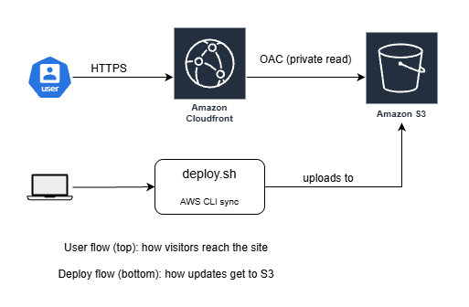
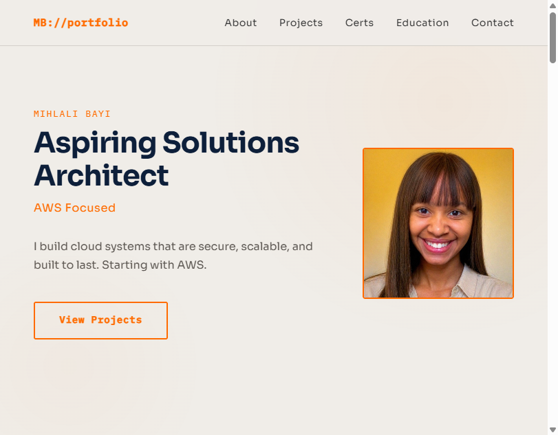
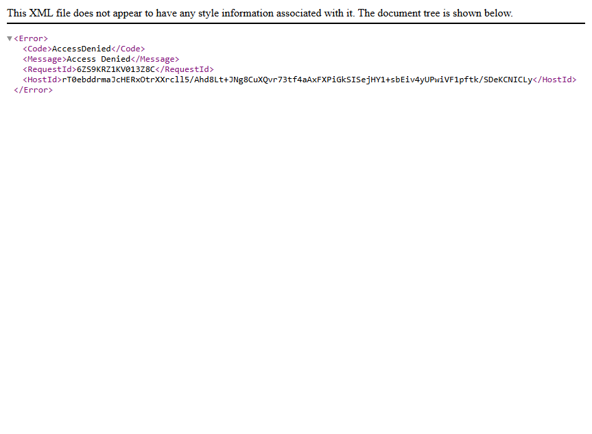

# AWS Portfolio Website

I built this portfolio site on AWS to showcase my projects, certifications, and the direction I'm taking my career as an aspiring Solutions Architect. It runs on Amazon S3 behind CloudFront, with Origin Access Control (OAC) so the bucket stays fully private and only CloudFront can read from it.

**Live site:** https://d1c4i4mapjz151.cloudfront.net



## What this project demonstrates

- Static site hosting on S3 fronted by CloudFront for HTTPS and global edge caching
- Private S3 bucket locked down with Origin Access Control, which is the modern AWS-recommended pattern that replaces the older OAI
- Bucket policy scoped to a specific CloudFront distribution using `AWS:SourceArn`, so even other AWS accounts can't read the bucket
- Deployment automated through a simple Bash script using the AWS CLI

## Architecture

When a user visits the site, the request hits CloudFront over HTTPS. CloudFront either serves a cached copy from the nearest edge location, or fetches the file from S3 using its OAC permissions. The S3 bucket itself has all public access blocked, so there's no way to reach the files except through CloudFront.

When I push an update, I run `./deploy.sh` from my Codespace. The script uses `aws s3 sync` to upload only changed files, then creates a CloudFront invalidation so visitors see the new version immediately.

## Stack

- **Frontend:** HTML, CSS, JavaScript (vanilla, no framework)
- **Hosting:** Amazon S3 (private bucket, all public access blocked)
- **CDN and HTTPS:** Amazon CloudFront
- **Security:** Origin Access Control restricting S3 access to this specific distribution
- **Deploy:** AWS CLI via `deploy.sh` shell script
- **Region:** Africa (Cape Town), `af-south-1`

## Deployment

To deploy a new version from the repo root:

```bash
./deploy.sh
```

The script does two things. First it runs `aws s3 sync` to upload changed files to the S3 bucket and remove anything that was deleted locally. Then it runs `aws cloudfront create-invalidation` to clear the CDN cache so users see the new version.

CI/CD with GitHub Actions is planned (see Project 04 in the portfolio) and will replace this manual trigger with an automatic deploy on every push to `main`.

## The OAC migration

I originally deployed this with S3 static website hosting and a public bucket policy. That's the simplest setup but it's not the way AWS recommends, because the bucket was directly accessible by URL and bypassed CloudFront entirely.

I migrated to a private bucket with CloudFront OAC. Now:

- All public access on the bucket is blocked at the account level
- The bucket policy only allows `s3:GetObject` from the CloudFront service principal
- The policy is scoped to this specific distribution using `AWS:SourceArn`
- Static website hosting is disabled, and CloudFront handles `index.html` routing via the Default Root Object setting

The proof it worked is below. Visitors still load the site through CloudFront, but the S3 URL now returns `AccessDenied`.

**Site loading via CloudFront:**


**S3 direct access blocked:**


The full step-by-step screenshots from the migration are in [`docs/screenshots/`](docs/screenshots/).

## What I learned

- The difference between the S3 website endpoint (`bucket.s3-website-region.amazonaws.com`) and the REST endpoint (`bucket.s3.region.amazonaws.com`). OAC only works with the REST endpoint, which is why the migration required changing the CloudFront origin.
- Default Root Object matters once you stop using S3 website hosting. Without it, the root URL (`/`) wouldn't know to serve `index.html` and would return errors.
- `aws s3 sync --delete` is powerful but slightly dangerous. It deletes anything from S3 that isn't in your local repo. I learned this the first time I ran the script, when it cleaned up an old orphan file I'd forgotten about. The lesson is to keep the repo as the single source of truth and not upload manually to S3 anymore.
- Cost transparency. This whole project runs within the AWS Free Tier. Total monthly cost so far: $0.

## Cost

Free Tier. The architecture uses S3 (free tier covers 5 GB storage and 20,000 GET requests per month) and CloudFront (always-free tier covers 1 TB data transfer out and 10 million requests per month).

## What's in the repo

The site files are at the root: `index.html`, `style.css`, `script.js`, and an `assets/` folder for images served on the live site. The `deploy.sh` script handles deployments. Documentation lives in `docs/`, which contains the architecture diagram and a `screenshots/` folder with the full OAC migration walkthrough. The `docs/` folder is excluded from the S3 deploy so it doesn't end up on the live site.

## Next steps

- **Project 04:** Replace `deploy.sh` with a GitHub Actions workflow so deploys happen automatically on push
- Add a custom domain via Route 53 and an ACM certificate
- Add CloudWatch monitoring for request counts and error rates